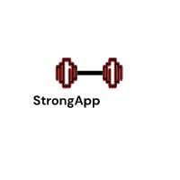

# Proyecto fin de ciclo


[Demo Vídeo](doc/video/StrongApp-demo.mp4)

## Descripción
El proyecto consiste en una aplicación web para el seguimiento de las mejores marcas personales de los atletas que practiquen CrossFit o cualquier otra disciplina que englobe movimientos gimnásticos o de halterofilia y su evolución así como la creación de una comunidad propia.

## Puesta en marcha

Para acceder a la aplicación tan sólo será necesario tener un navegador instalado en el dispositivo que deseemos y acceder a la dirección web:

www.strongapp.adrivillab.com

Para acceder al Bot de Telegram simplemente basta con añadir a ```@StrongAppBot``` a tus chats de Telegram

## Uso

A la hora de acceder a la página web tan sólo es necesario desplegar el menú, situado en la parte superior izquierda señalizado con tres barras horizontales rojas, una vez visualizado, la navegación es intuitiva entre las secciones.

## Sobre el autor

Mi nombre es Mario Vázquez Otero, soy programador full-stack a la vez que imparto clases de CrossFit, movimientos gimnásticos y halterofilia en CrossFit SCQ en el centro multideportivo Unit365, O Milladoiro.

## Licencia
*GNU Free Documentation License Version 3.0*

[`LICENSE`](StrongApp/LICENSE) en la raiz del repositorio.

## Índice

1. Anteproyecto
    * 1.1. [Idea](doc/templates/1.1_idea.md)
    * 1.2. [Necesidades](doc/templates/1.2_necesidades.md)
2. [Diseño](doc/templates/2_diseño.md)
3. [Implantación](doc/templates/3_implantacion.md)


## Guía de contribución

Para contribuír con este proyecto sería interesante el feedback de la mayor parte de usuarios posibles a través del formulario de contacto de la web a través del cual se pueden poner en contacto con el administrador tanto usuarios registrados como no registrados.

Serán bienvenidas nuevas ideas para implementar nuevas features así como mejoras en la interfaz de usuario, colocación de botones, disposición de elementos en la pantalla...

## Links

- [Página principal de Meteor](https://www.meteor.com/)

- [Librería Meteor Accounts](https://guide.meteor.com/accounts.html)

- [Adjuntar esquemas a Mongo.Collections](https://github.com/Meteor-Community-Packages/meteor-collection2)

- [Enrutado Meteor](https://iron-meteor.github.io/iron-router/)

- [Files for Meteor](https://github.com/veliovgroup/Meteor-Files)

- [Librería npm esquemas bases de datos MongoDb](https://github.com/veliovgroup/Meteor-Files)

- [MongoDb para Meteor](https://docs.meteor.com/api/collections.html)

- [MongoDb](https://www.mongodb.com/home)

- [Librería npm para Bot de Telegram](https://www.npmjs.com/package/node-telegram-bot-api)

- [Leaflet API](https://leafletjs.com/)

- [OpenStreetMaps API](https://www.openstreetmap.org/#map=6/40.007/-2.488)

- [Framework CSS/HTML Semantic.UI](https://semantic-ui.com/)

- [Mailgun API](https://www.mailgun.com/es/)

