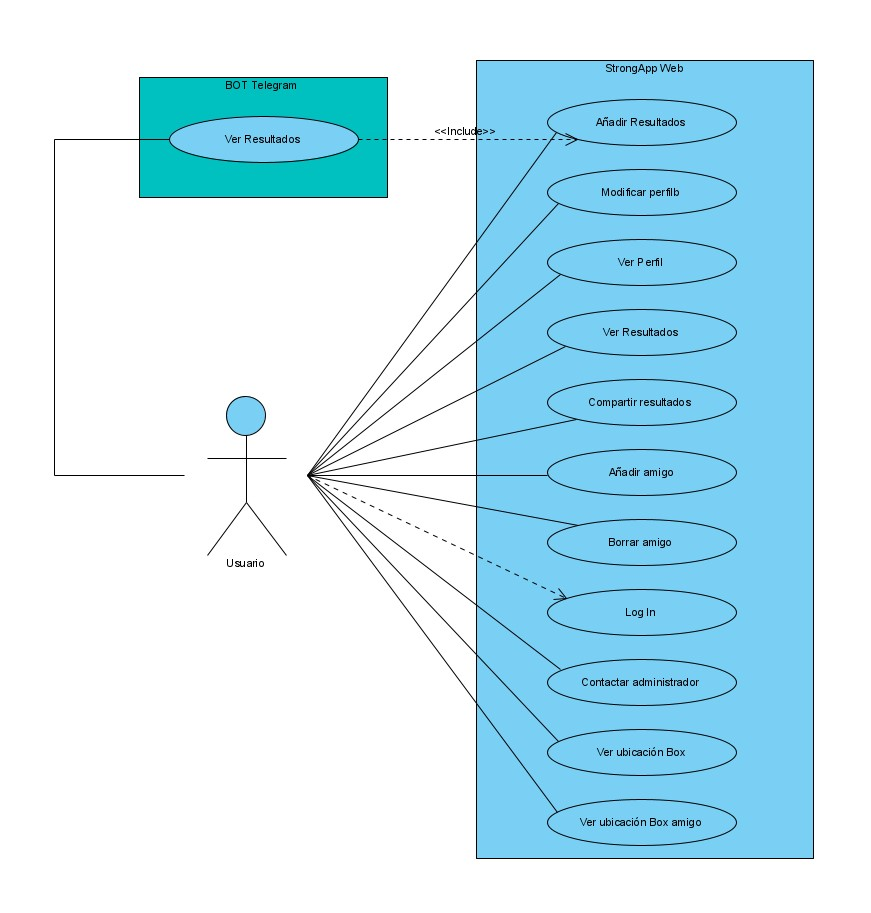
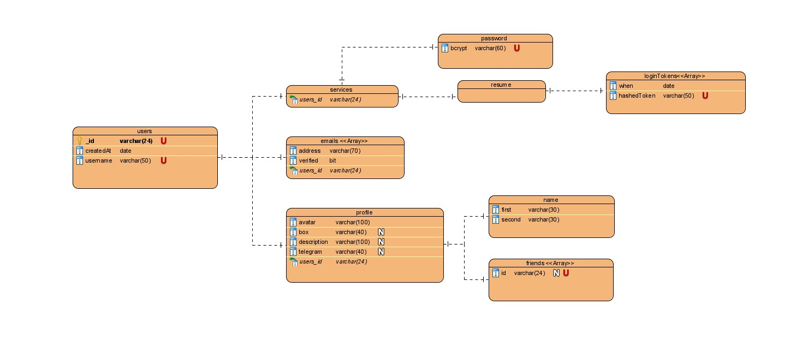
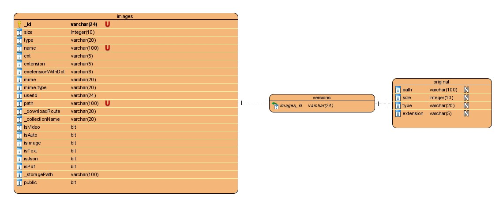
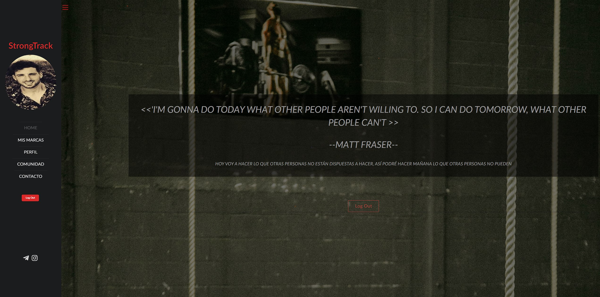
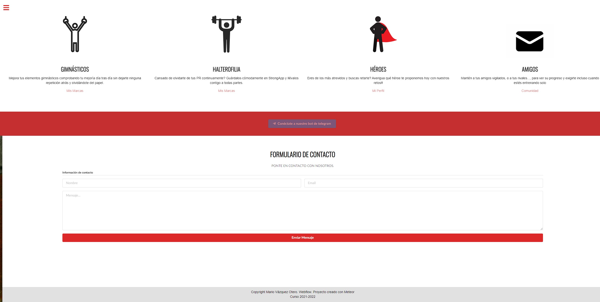
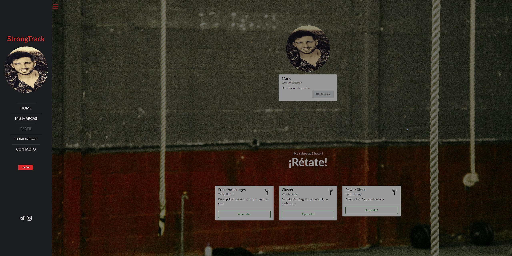
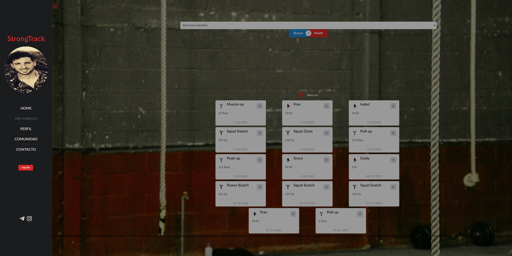
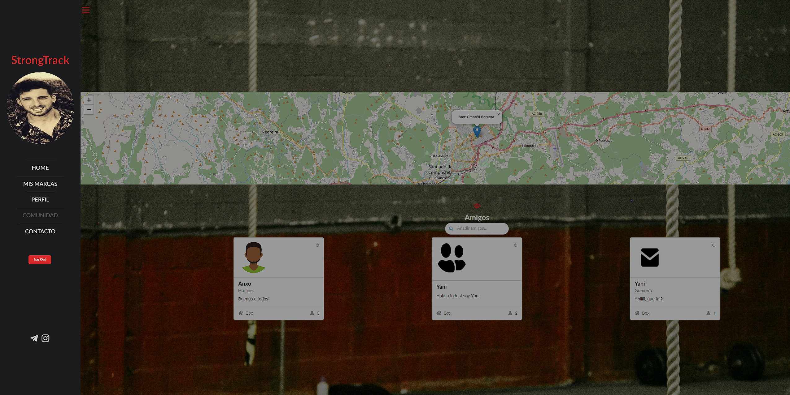
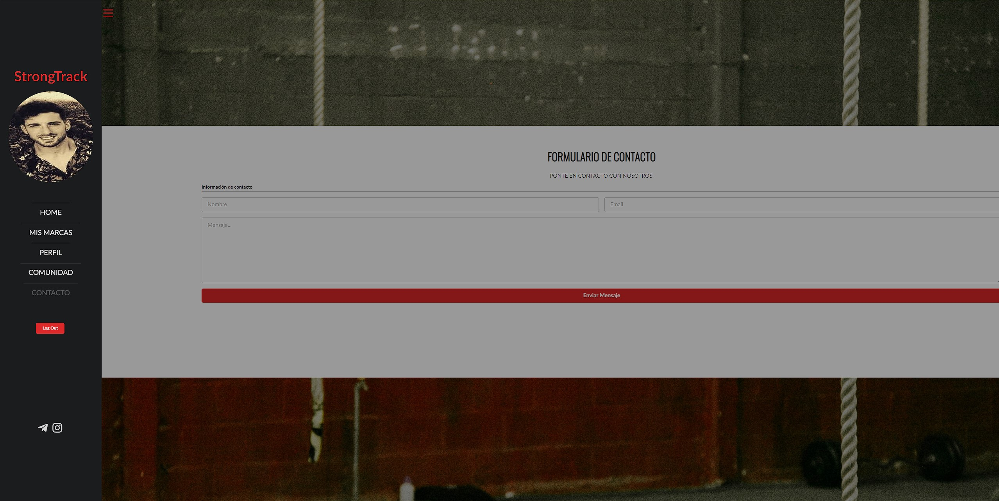

# FASE DE DISEÑO
## Casos de uso.

## Diagrama de Base de Datos.
### Diagrama usuarios

### Diagrama ejercicios y ejercicios de usuarios

### Diagrama de roles y asignación de roles

### Diagrama de imágenes

## Deseño de interface de usuarios [mockups].
### /home y /home scroll

### /perfil

### /marcas:_id

### /comunidad

### /contacto

